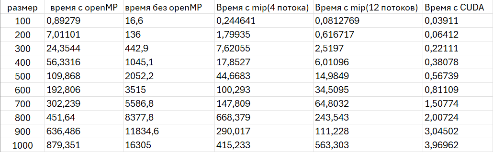
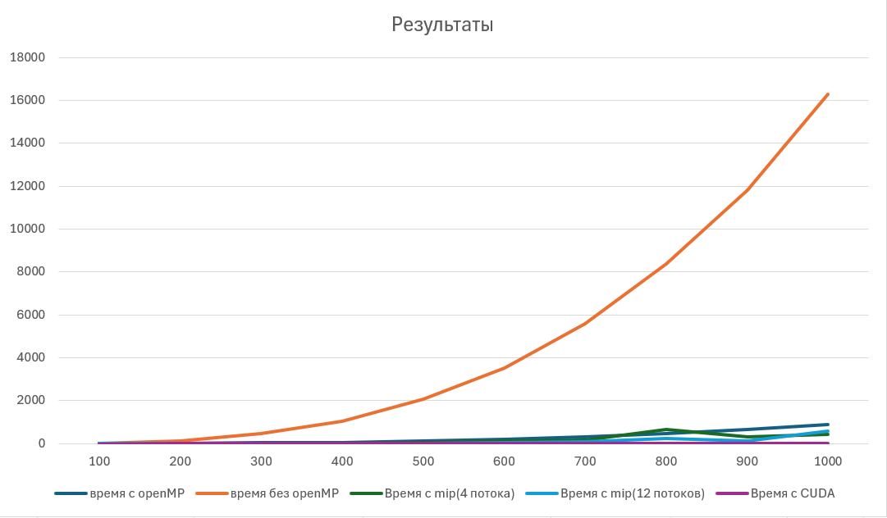

## Отчет по лабораторной работе №3

### Задание на лабораторную работу:
Модифицировать программу из л/р №1 для параллельной работы по
технологии MPI. Запустить параллельную версию на Суперкомпьютере Королёв. 

### Исходный код решения
* [mip.cpp](mip.cpp) - основное задание, измененное под 3ую л/р: генерация, запись/чтение матриц из файла и их умножение с помощью MPI.
* [4.txt](4.txt) - результат запуска на суперкомпьютере с 4 потоками
* [12.txt](12.txt) - результат запуска на суперкомпьютере с 12 потоками

### Результаты экспериментов и выводы:
В коде была выполнена редукция для объединения частичных результатов умножения матриц, полученных на разных процессах MPI.
Лабораторная запускалась на суперкомпьютере "Сергей Королев" с 4 и 12 потоками

Результаты в миллисекундах:

График сравнения времени вычислений:

### Вывод:
Использование MPI с 4 процессами позволило ускорить умножение матриц примерно в 39 раз (415 мс вместо 16305 мс при N=1000), а с 12 процессами — в 29 раз (563 мс).Таким образом, применение MPI позволяет значительно ускорить умножение матриц при правильной настройке, однако эффективность зависит от баланса между вычислениями и коммуникациями.
