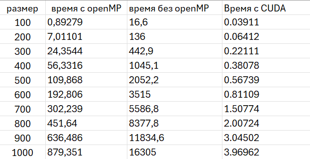
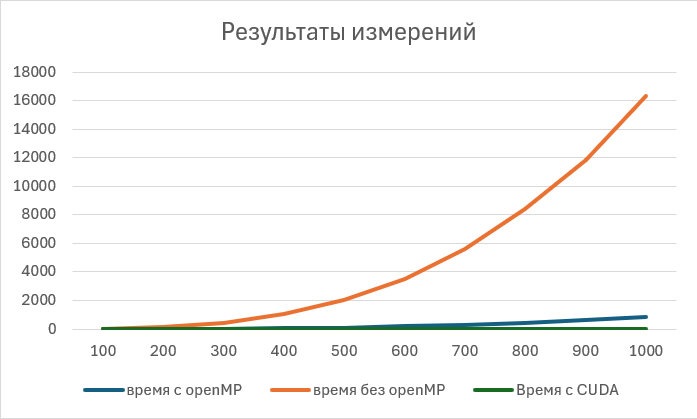

## Отчет по лабораторной работе №4
### Задание на лабораторную работу:
Модифицировать программу из л/р №1 для параллельной работы по
технологии CUDA.
### Исходный код решения лабораторной работы
* [cudamatrix.cu](cudamatrix.cu) - изменёная 1 л/р с использованием технологии CUDA.
* для выполнения лаборвторной работы использовалась видеокарта NVIDIA GeForce RTX 3060
### Результаты экспериментов и выводы:
Таблица с результатами вычислений(в миллисекундах):

График с результатами вычислений(в миллисекундах):

### Вывод:
лабораторная работа реализованная на CUDA показывает, что даже простая версия на одном блочном ядре даёт ускорение в сотни и тысячи раз для моих размерностей. Таким образом, использование GPU через CUDA позволяет существенно сократить время вычислений и расширить практический диапазон решаемых задач.
